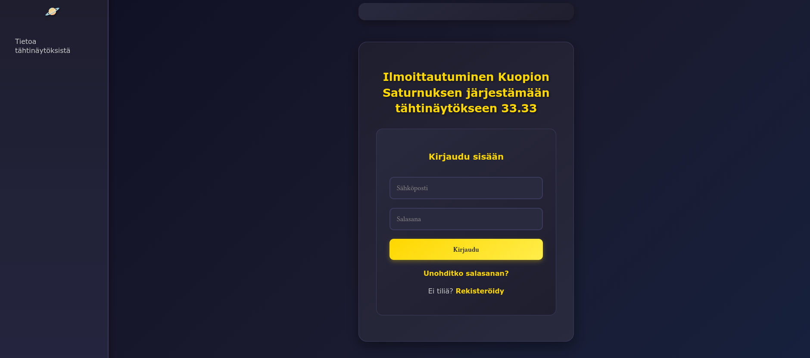

# Kuopio Saturnus - Event Registration App

This is a web application built for the Kuopio Saturnus Astronomy Society to manage registrations for their star shows.  
Users can register, log in, and sign up for available time slots. Admins can manage event dates and reset registrations.

## Technologies Used

- HTML / CSS / JavaScript
- Firebase Authentication (email/password)
- Firebase Firestore (registration data storage)
- Firebase Hosting (live deployment)

## Features

- User registration and login with email
- Sign up for specific time slots
- Automatic limit on maximum participants per slot
- Admin features:
  - Reset all registrations
  - Edit event date
- Responsive design for both desktop and mobile

## Notes

- Email addresses are used solely for registration purposes and will not be published or shared.

## Preview

